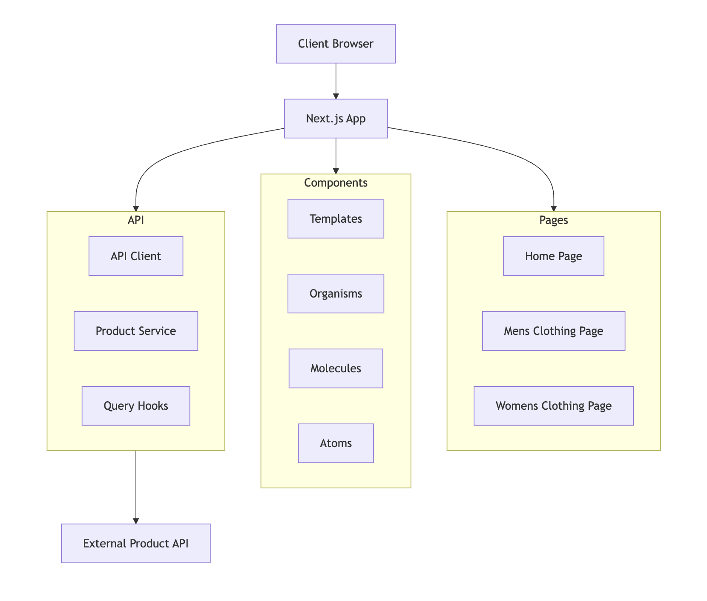
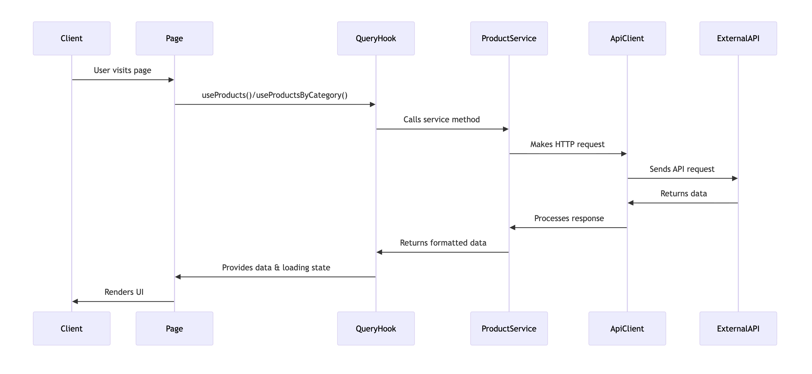

# Welcome to **Modern Walk**

## Live Demo

Experience Modern Walk in action **[https://modern-walk-seven.vercel.app/](https://modern-walk-seven.vercel.app/)**

## Features

- **Responsive Design**: Optimized for desktop, tablet, and mobile devices
- **Product Catalog**: Browse men's and women's clothing collections
- **Flash Sales**: Featured top-rated products with special deals
- **Smart Navigation**: Intuitive category-based browsing
- **Theme Switcher**: Seamless light/dark mode toggle with system preference detection
- **Product Carousel**: Interactive product showcases with navigation
- **Error Handling**: Graceful error states and loading indicators
- **Data Caching**: Intelligent caching with TanStack React Query for optimal performance
- **Background Refetching**: Automatic data updates with configurable stale times
- **Performance Optimized**: Built with Next.js 15 and React 19 for optimal performance
- **Type Safe**: Full TypeScript support for robust development

## Tech Stack

### Frontend

- **Framework**: [Next.js 15](https://nextjs.org/) with App Router
- **React**: Version 19.1.0 with latest features
- **TypeScript**: Full type safety and developer experience
- **Styling**: [Tailwind CSS 4](https://tailwindcss.com/) with modern design system
- **UI Components**: [Shadcn UI](https://ui.shadcn.com/) primitives
- **Icons**: [Lucide React](https://lucide.dev/) for consistent iconography

### State Management & Data Fetching

- **Data Fetching**: [TanStack Query (React Query)](https://tanstack.com/query/latest) v5.90.2
  - Server state management with intelligent caching
  - Background refetching and synchronization
  - Automatic retries with exponential backoff
  - Built-in loading and error states
  - React Query DevTools for debugging
- **HTTP Client**: [Axios](https://axios-http.com/) with custom interceptors
- **Theme Management**: [next-themes](https://github.com/pacocoursey/next-themes)

### Development Tools

- **Linting**: [ESLint](https://eslint.org/) with Next.js configuration
- **Code Formatting**: [Prettier](https://prettier.io/)
- **Git Hooks**: [Husky](https://typicode.github.io/husky/) with lint-staged
- **Commit Linting**: [Commitlint](https://commitlint.js.org/) with conventional commit standards
- **Build Tool**: Turbopack for faster development builds

### Architecture

- **Component Architecture**: Atomic Design (Atoms → Molecules → Organisms → Templates)
- **Custom Hooks**: Reusable logic for text truncation and product sorting
- **API Layer**: Centralized service layer with proper error handling
- **Data Layer**: TanStack React Query for server state management with query keys pattern
- **Providers**: Context-based providers for theme, queries, and hydration

## Architecture Diagrams

### Application Architecture



The application architecture diagram shows the high-level structure of Modern Walk, illustrating how different layers interact with each other, from the UI components down to the data layer.

### Data Flow Diagram



The data flow diagram demonstrates how data moves through the application, from API requests to rendering in the UI, including the caching and state management processes.

## Prerequisites

Before you begin, ensure you have the following installed

- **Node.js**: Version 18.0 or higher
- **npm**: Version 8.0 or higher (comes with Node.js)
- **Git**: For version control

## Installation & Setup

1. **Clone the repository**

   ```bash
   git clone https://github.com/nimesha-edirisinghe/modern-walk.git
   cd modern-walk
   ```

2. **Install dependencies**

   ```bash
   npm install
   ```

3. **Environment Configuration**
   Create a `.env.local` file in the root directory

   ```bash
   NEXT_PUBLIC_API_BASE_URL=https://fakestoreapi.com
   ```

4. **Start the development server**

   ```bash
   npm run dev
   ```

5. **Open your browser**
   Navigate to [http://localhost:3000](http://localhost:3000)

## Testing

The project uses Jest and React Testing Library for comprehensive unit testing. Tests are organized following the same atomic design pattern as the components.

### Test Structure

```
src/
├── components/
│   ├── atoms/__tests__/         - Basic component tests
│   │   ├── Button.test.tsx
│   │   └── Tooltip.test.tsx
│   ├── molecules/__tests__/     - Composite component tests
│   │   ├── CategoryTile.test.tsx
│   │   ├── ErrorState.test.tsx
│   │   ├── ProductCard.test.tsx
│   │   └── ThemeSwitcher.test.tsx
│   ├── organisms/__tests__/     - Complex component tests
│   │   └── Navbar.test.tsx
│   └── templates/__tests__/     - Page template tests
│       ├── CategoryPageTemplate.test.tsx
│       └── HomePageTemplate.test.tsx
```

### Testing Tools

- **Framework**: Jest v30.1.3
- **Testing Library**: React Testing Library v16.3.0
- **User Event Testing**: @testing-library/user-event v14.6.1
- **Coverage Reports**: Jest built-in coverage reporter
- **Environment**: jest-environment-jsdom for browser API simulation

### Test Scripts

- `npm run test` - Run all tests
- `npm run test:watch` - Run tests in watch mode (development)
- `npm run test:coverage` - Generate test coverage report
- `npm run test:ci` - Run tests in CI environment

### Pre-commit Hooks

Tests are automatically run on staged files during commits using lint-staged:

```json
"lint-staged": {
  "*.{js,jsx,ts,tsx}": [
    "eslint --fix",
    "prettier --write",
    "jest --bail --findRelatedTests"
  ]
}
```

## Available Scripts

- `npm run dev` - Start development server with Turbopack
- `npm run build` - Build the application for production
- `npm run start` - Start the production server
- `npm run lint` - Run ESLint for code quality checks
- `npm run prepare` - Set up Husky git hooks
- `npm run test` - Run all tests
- `npm run test:watch` - Run tests in watch mode
- `npm run test:coverage` - Generate test coverage report
- `npm run test:ci` - Run tests in CI environment

## Git Commit Guidelines

This project uses [Commitlint](https://commitlint.js.org/) with [Conventional Commits](https://www.conventionalcommits.org/) to ensure consistent commit message formatting. All commit messages are automatically validated using Husky hooks.

### Commit Message Format

```
<type>: <description>
```

### Allowed Types

- **feat**: A new feature for the user
- **fix**: A bug fix
- **docs**: Documentation only changes
- **style**: Changes that do not affect the meaning of the code (white-space, formatting, etc.)
- **refactor**: A code change that neither fixes a bug nor adds a feature
- **perf**: A code change that improves performance
- **test**: Adding missing tests or correcting existing tests
- **build**: Changes that affect the build system or external dependencies
- **ci**: Changes to CI configuration files and scripts
- **chore**: Other changes that don't modify src or test files
- **revert**: Reverts a previous commit

### Examples

```bash
# ✅ Valid commit messages
git commit -m "feat: add user authentication system"
git commit -m "fix: resolve navigation bug in mobile view"
git commit -m "docs: update README with installation steps"
git commit -m "chore: update dependencies to latest versions"
git commit -m "refactor: simplify product sorting logic"

# ❌ Invalid commit messages (will be rejected)
git commit -m "added new feature"          # Missing type
git commit -m "Fix: bug in header"         # Type should be lowercase
git commit -m "feat: Add new feature."     # No trailing period allowed
git commit -m "update readme"              # Missing type and proper format
```

### Validation Rules

- **Type**: Must be one of the allowed types (lowercase)
- **Description**: Must be present and not empty
- **Case**: Description should be in lowercase
- **Punctuation**: No trailing period in description

The commit message validation runs automatically on every commit. If your message doesn't follow the convention, the commit will be rejected with helpful error messages.

## Project Structure

```
src/
├── app/                    - Next.js App Router pages
│   ├── layout.tsx          - Root layout with providers
│   ├── page.tsx            - Home page with flash sales
│   ├── mens-clothing/      - Men's clothing category
│   └── womens-clothing/    - Women's clothing category
├── components/             - UI Components (Atomic Design)
│   ├── atoms/              - Basic building blocks
│   ├── molecules/          - Simple component combinations
│   ├── organisms/          - Complex UI sections
│   └── templates/          - Page-level templates
├── hooks/                  - Custom React hooks
├── lib/                    - Core utilities and configurations
│   ├── api/                - API layer and services
│   │   ├── client.ts       - Axios HTTP client configuration
│   │   ├── keys.ts         - React Query key factories
│   │   ├── queries/        - React Query hooks
│   │   └── services/       - API service functions
│   └── utils.ts            - Utility functions
├── providers/              - React context providers
│   ├── QueryProvider.tsx   - TanStack React Query provider
│   └── ThemeProvider.tsx   - Theme context provider
├── types/                  - TypeScript type definitions
└── utils/                  - Helper functions
```

## Component Architecture

The project follows **Atomic Design** pattern

- **Atoms**: Basic UI elements (Button, Tooltip)
- **Molecules**: Simple combinations (ProductCard, CategoryTile, ErrorState)
- **Organisms**: Complex sections (Navbar, ProductCarousel)
- **Templates**: Page layouts (CategoryPageTemplate, HydrationSafeBody)

## Data Fetching with TanStack React Query

The application uses **TanStack React Query v5** for efficient server state management and data fetching. This provides several benefits

### Features

- **Intelligent Caching**: Data is cached automatically with configurable stale times
- **Background Refetching**: Data stays fresh with automatic background updates
- **Error Handling**: Built-in error states and retry mechanisms
- **Loading States**: Automatic loading indicators for better UX
- **DevTools**: React Query DevTools for debugging and monitoring

## API Integration

The application integrates with the [Fake Store API](https://fakestoreapi.com/) to provide:

- Product listings and details
- Category-based filtering
- Top-rated product recommendations
- Real-time data with React Query caching and background synchronization
